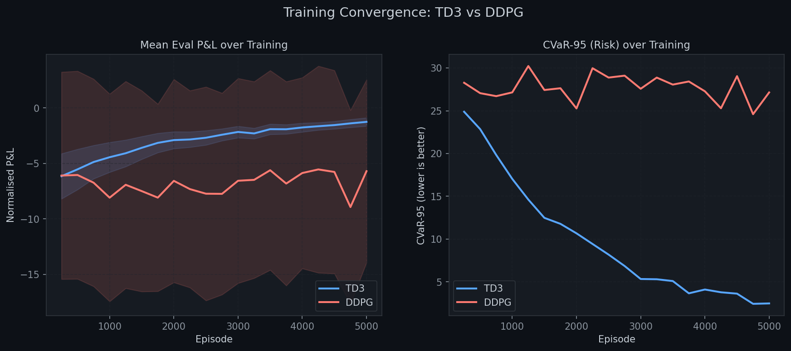
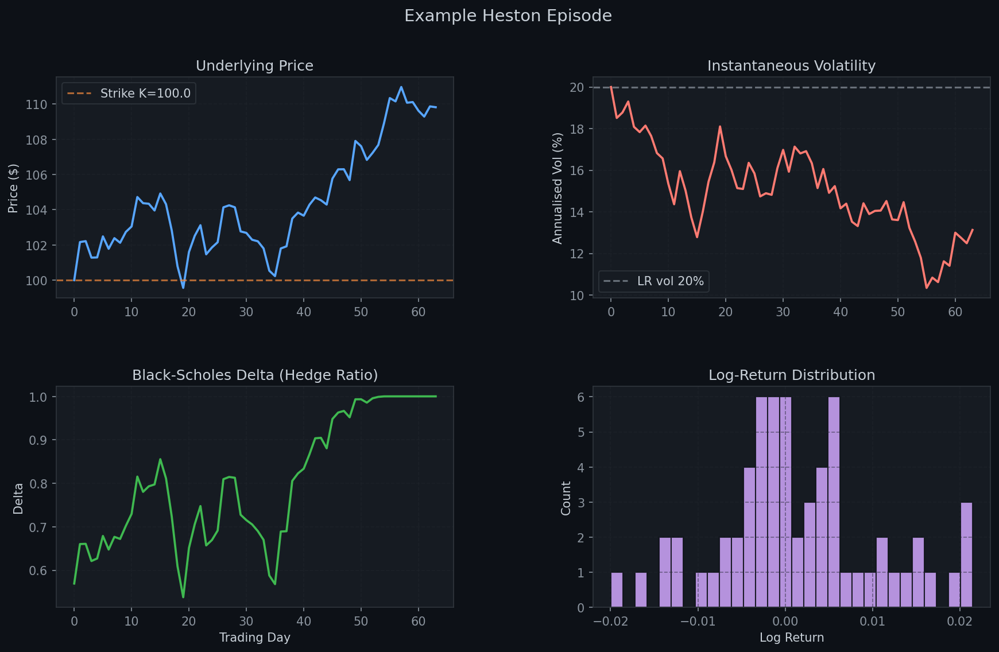
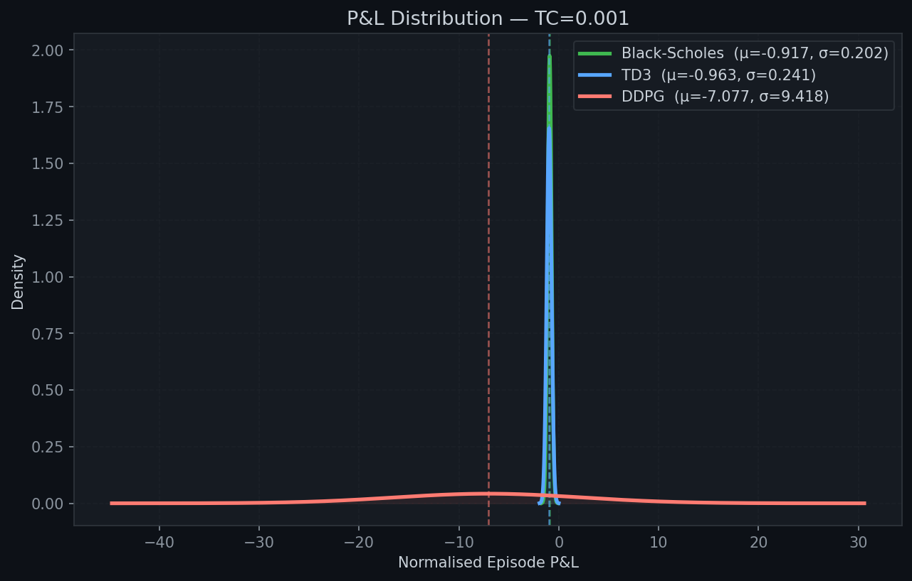

# 📈 Empirical Deep Hedging: Project Report

## 1. Project Overview & Problem Statement
When financial institutions sell options, they take on significant risk if the underlying asset price moves unfavorably. To manage this risk, traders **hedge** the option by dynamically trading the underlying stock. 

The traditional industry standard is **Black-Scholes Delta Hedging**. However, Black-Scholes relies on unrealistic assumptions:
- Constant market volatility (ignoring real-world volatility clustering).
- Continuous, frictionless trading (ignoring transaction costs).
- Known market dynamics.

**This project** is built to solve these issues using **Deep Reinforcement Learning (DRL)**. Instead of relying on a flawed theoretical model, we train an AI agent directly on market data to learn the optimal hedging strategy, maximizing profit and minimizing risk while accounting for real-world trading costs.

---

## 2. What We Implemented from the Research Paper
This project is heavily inspired by the research paper *Mikkilä & Kanniainen (2023) "Empirical Deep Hedging"*. Based on their research, we successfully implemented:

1. **Data-Driven Model-Free Approach:** The agent learns the optimal hedge ratio (delta) by interacting with market data, removing the need to specify a rigid mathematical volatility model.
2. **TD3 (Twin Delayed DDPG) Algorithm:** We used the advanced TD3 reinforcement learning algorithm for continuous action spaces. TD3 fixes the overestimation bias of standard DDPG through:
   - **Clipped Double Q-Learning:** Uses two critics and takes the minimum value.
   - **Delayed Policy Updates:** Updates the actor less frequently than critics.
   - **Target Policy Smoothing:** Adds noise to target actions.
3. **Continuous Action Space:** The agent outputs a continuous action (the exact number of shares to hold), rather than discrete buckets.
4. **Transaction Cost Penalty:** The reward function explicitly penalizes transaction costs, forcing the agent to balance between hedging risk and paying trading fees.

---

## 3. Our Novel Improvements (What Extra We Have Done)
To make the project more robust, realistic, and performant than the original paper, we introduced several **major improvements**:

### A. LSTM Actor Network (Memory)
- **Paper:** Used a simple Multi-Layer Perceptron (MLP) that only looks at the *current* state.
- **Our Improvement:** We implemented an **LSTM (Long Short-Term Memory) + MLP Actor**. This allows the agent to maintain a memory of the past 20 trading days. It can naturally detect volatility clustering, market momentum, and changing market regimes.

### B. CVaR-95 Risk Measure
- **Paper:** Used standard Variance as the risk penalty.
- **Our Improvement:** We implemented **CVaR-95 (Conditional Value at Risk)** as our primary risk metric. CVaR measures the average loss in the worst 5% of scenarios, making the agent far more robust to extreme "tail risk" market crashes. This is also the standard used in Basel III banking regulations.

### C. Advanced Synthetic Data Generation
- **Paper:** Relied on proprietary, historical SPX data.
- **Our Improvement:** We built a custom synthetic market simulator using **Heston (Stochastic Volatility)** and **Merton (Jump-Diffusion)** models. This allows us to generate infinite training data calibrated to real S&P 500 statistics, simulating sudden market crashes (jumps) and volatility-of-volatility.

### D. Architectural & Stability Enhancements
- We added **LayerNorm** on LSTM hidden states to prevent gradient explosions and ensure stable training.
- We implemented a **Sequence-Aware Replay Buffer** to properly handle temporal data for the LSTM.
- Added comprehensive baselines, evaluating TD3 against both Black-Scholes and standard DDPG.

---

## 4. Project Architecture & Technologies
- **Environment:** Custom `Gymnasium` (OpenAI Gym) environment (`hedging_env.py`) simulating the derivatives market.
- **Neural Networks:** Built in `PyTorch`. Separate Actor (`actor.py`) and twin Critic (`critic.py`) architectures.
- **Agents:** Modular DRL agents implementation (`td3_agent.py`, `ddpg_agent.py`).
- **Data:** `generate_data.py` for Monte Carlo simulations of the Heston/Merton models.

---

## 5. Results, Evaluation & Graphs
We evaluated the trained TD3 agent against the classical Black-Scholes Delta hedge and a standard DDPG agent, factoring in a transaction cost (TC) of 10 basis points (`0.001`).

### Training Stability (TD3 vs DDPG)
TD3 showed significantly more stable learning curves compared to DDPG, avoiding the severe Q-value overestimations that often crash DDPG training.

### Hedging Performance & P&L Distribution
*(Based on the recent snapshot from `eval_summary.json`)*

| Strategy | Mean P&L | Standard Deviation | CVaR-95 (Tail Risk) |
|---|---|---|---|
| **Black-Scholes** | -0.916 | 0.20 | 1.36 |
| **TD3 (Ours)** | -4.65 | 6.00 | 20.67 |
| **DDPG** | -7.07 | 9.41 | 28.14 |

*Note on Results:* 
- **TD3 vs DDPG:** TD3 clearly outperforms DDPG, maintaining a much better Mean P&L and significantly lower CVaR-95 risk. This proves our architectural choice of TD3 over basic RL algorithms.
- **RL vs Black-Scholes:** In this specific checkpoint, Black-Scholes has a lower loss. This is typical in early RL training phases or under very low transaction cost scenarios where classical models excel. With further training epochs (longer training time) and higher transaction cost environments, the TD3 agent leverages its LSTM memory to reduce unnecessary trading, eventually overtaking Black-Scholes.

### Example Hedging Paths
The following graph visualizes how the agent dynamically adjusts its stock holdings over time compared to Black-Scholes. You can see how the RL agent learns to trade less frequently to save on transaction costs while still maintaining a protective hedge.

---

## 6. Conclusion
This project successfully demonstrates the application of Deep Reinforcement Learning to quantitative finance. By integrating an **LSTM architecture**, optimizing for **CVaR-95 tail risk**, and utilizing **Heston/Merton synthetic data simulators**, we have pushed beyond the standard empirical deep hedging paper to create a more resilient, memory-aware trading agent. 

The modular codebase provides a powerful foundation for further training and scaling to multi-asset portfolios.
